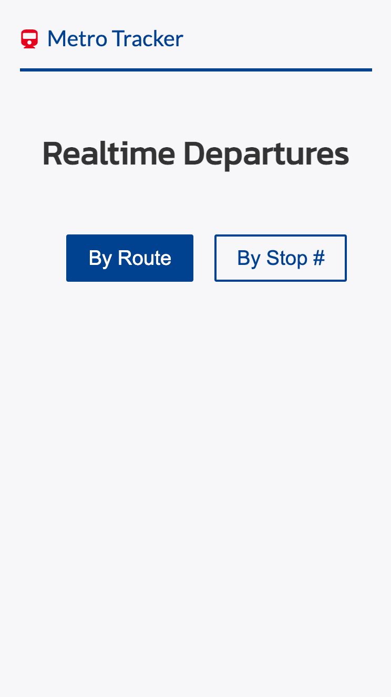
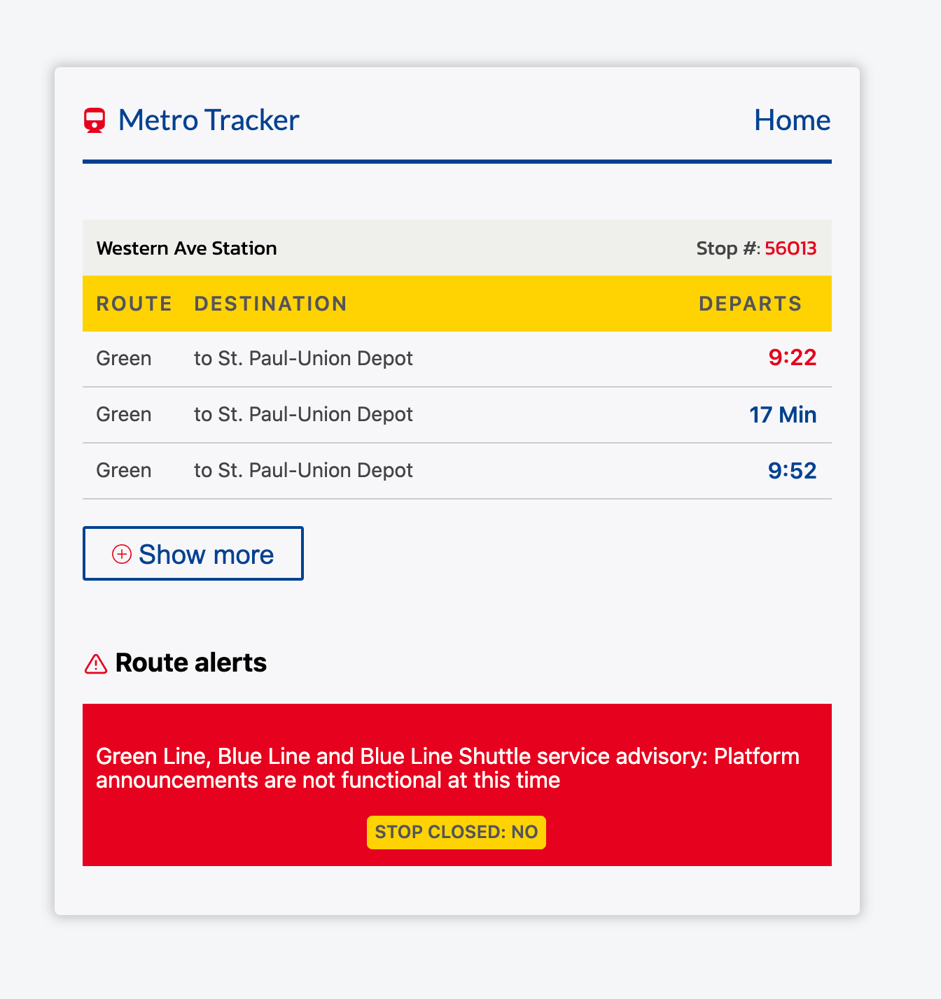
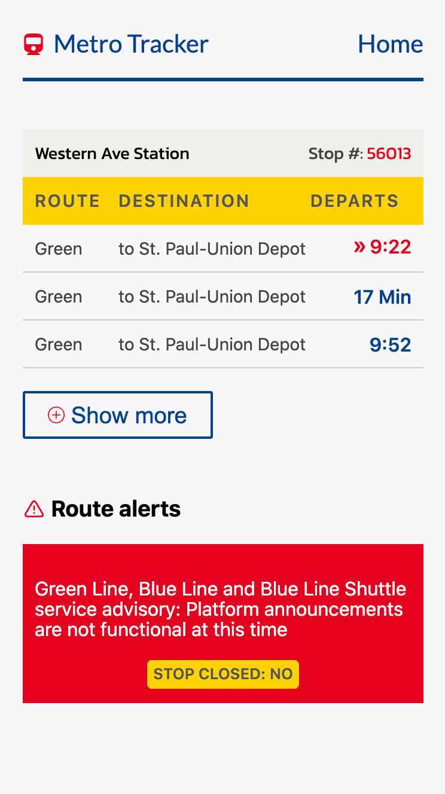

# MetroTracker

The MetroTracker web application allows users to track and view departure times, select a custom route, and view alerts for the route selected.

View prod demo link:

[TransitTracker](https://metro-iota.vercel.app/)

## Installation

Yarn is the package manager. It will install and manage the dependencies.

- ### `yarn install`

  to install the required dependencies

- ### `yarn run dev`

  to run the application locally in development mode.

  - Open `http://localhost:3000` to view the application in the browser

## Testing

### Unit Tests

Unit tests are located in the `src` folder inside the components folders in files named like `*.test.js`.

- `yarn test` : single run of the unit tests
- `yarn test:coverage`: run test coverage

## Features

- Used Next.js to build the web application
- Data is rendered using a combination of Client-Side and Server-Side
- Added user feedback for data fetching and a better user experience, assuming most users will be using mobile and/or data on mobile phones
- Users can select a route or enter a stop number
- Departure data is auto revalidated every 60 seconds, as well as on browser focus
- Alerts for the given route/stop are displayed for users
- Application routing allows users to respond to browser history (back, forward)
- Users can tab through the pages with a keyboard (accessibility)
- Responsive designs for mobile, tablet, and desktop users
- Used Sass for modular CSS
- Added error handling if API/data errors occur

## Assumptions

- Due to cached data, API call revalidation occurs every 60 second. Due to API restrictions (excessive calls less than 30 seconds are unwarranted)

## Screenshots

Behavior:

Home screen:

Alerts:

